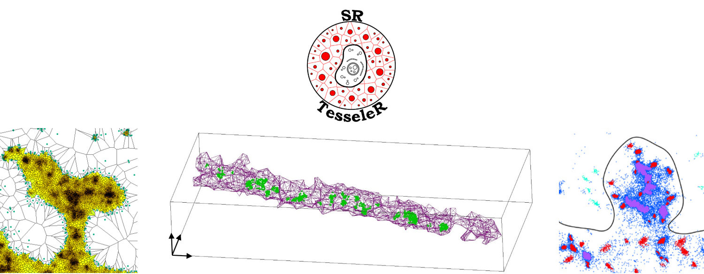

# Neubias Academy 2020
## A guided tour for analyzing and quantifying single-molecule localization microscopy data
## Part two: quantification strikes back

### Webinar

* Slides: [slides.pdf](2020_06_11_SMLM_quantification_NEUBIAS_Academy.pdf)
* Main project page/ C++ code / Windows installer: [https://github.com/flevet/SR-Tesseler](https://github.com/flevet/SR-Tesseler)
* Forum: [https://forum.image.sc](https://forum.image.sc/) (tag "tesseler")

* Slides of Part one by Siân Culley: [slides.pdf](https://github.com/superresolusian/NEUBIAS-webinar/blob/master/A%20guided%20tour%20for%20analyzing%20and%20quantifying%20single-molecule_short.pdf)

### Contact

[Florian Levet](mailto:florian.levet@u-bordeaux.fr)

### Reference to papers presented in the slides

**Slide 3**

Rossier, O., Octeau, V., Sibarita, J. _et al._  Integrins β1 and β3 exhibit distinct dynamic nanoscale organizations inside focal adhesions. _Nat Cell Biol_ **14,** 1057–1067 (2012). 
[https://doi.org/10.1038/ncb2588](https://doi.org/10.1038/ncb2588)

**Slide 4**

Charlotte Mariani-Floderer, Jean-Baptiste Sibarita, Cyril Favard, and Delphine M. Muriaux.AIDS Research and Human Retroviruses.Jul 2016.658-659.
[http://doi.org/10.1089/aid.2016.0052](http://doi.org/10.1089/aid.2016.0052)

Rossier, O., Octeau, V., Sibarita, J. _et al._  Integrins β1 and β3 exhibit distinct dynamic nanoscale organizations inside focal adhesions. _Nat Cell Biol_ **14,** 1057–1067 (2012). 
[https://doi.org/10.1038/ncb2588](https://doi.org/10.1038/ncb2588)

Deepak Nair, Eric Hosy, Jennifer D. Petersen, Audrey Constals, Gregory Giannone, Daniel Choquet, Jean-Baptiste Sibarita. Super-Resolution Imaging Reveals That AMPA Receptors Inside Synapses Are Dynamically Organized in Nanodomains Regulated by PSD95. Journal of Neuroscience 7 August 2013, 33 (32) 13204-13224.
[https://doi.org/10.1523/JNEUROSCI.2381-12.2013](https://doi.org/10.1523/JNEUROSCI.2381-12.2013)

Levet, F., Hosy, E., Kechkar, A. _et al._ SR-Tesseler: a method to segment and quantify localization-based super-resolution microscopy data. _Nat Methods_ **12,** 1065–1071 (2015). 
[https://doi.org/10.1038/nmeth.3579](https://doi.org/10.1038/nmeth.3579)

**Slide 7**

Baddeley, D., Cannell, M., & Soeller, C. (2010). Visualization of Localization Microscopy Data. _Microscopy and Microanalysis,_ _16_(1), 64-72.
[https://doi.org/10.1017/S143192760999122X](https://doi.org/10.1017/S143192760999122X)

**Slide 10**

Deschout, H., Zanacchi, F., Mlodzianoski, M. _et al._  Precisely and accurately localizing single emitters in fluorescence microscopy. _Nat Methods_ **11,** 253–266 (2014).
[https://doi.org/10.1038/nmeth.2843](https://doi.org/10.1038/nmeth.2843)

Nicovich, P., Owen, D. & Gaus, K. Turning single-molecule localization microscopy into a quantitative bioanalytical tool. Nat Protoc 12, 453–460 (2017).
[https://doi.org/10.1038/nprot.2016.166](https://doi.org/10.1038/nprot.2016.166)

**Slide 11**

B. D. Ripley, _J ApplProbability_**13**, 255-66 (1976).

Lagache T, Lang G, Sauvonnet N, Olivo-Marin JC (2013) Analysis of the Spatial Organization of Molecules with Robust Statistics. PLOS ONE 8(12): e80914.
[https://doi.org/10.1371/journal.pone.0080914](https://doi.org/10.1371/journal.pone.0080914)

**Slide 13**

Truan Z, Tarancón Díez L, Bönsch C, et al. Quantitative morphological analysis of arrestin2 clustering upon G protein-coupled receptor stimulation by super-resolution microscopy. _J Struct Biol_. 2013;184(2):329‐334.
[https://doi.org/10.1016/j.jsb.2013.09.019](https://doi.org/10.1016/j.jsb.2013.09.019)

**Slide 16**

Sengupta, P., Jovanovic-Talisman, T., Skoko, D. _et al._ Probing protein heterogeneity in the plasma membrane using PALM and pair correlation analysis. _Nat Methods_ **8,** 969–975 (2011).
[https://doi.org/10.1038/nmeth.1704](https://doi.org/10.1038/nmeth.1704)

Veatch SL, Machta BB, Shelby SA, Chiang EN, Holowka DA, et al. (2012) Correlation Functions Quantify Super-Resolution Images and Estimate Apparent Clustering Due to Over-Counting. PLOS ONE 7(2): e31457.
[https://doi.org/10.1371/journal.pone.0031457](https://doi.org/10.1371/journal.pone.0031457)

**Slide 18**

Rubin-Delanchy, P., Burn, G., Griffié, J. _et al._ Bayesian cluster identification in single-molecule localization microscopy data. _Nat Methods_ **12,** 1072–1076 (2015).
[https://doi.org/10.1038/nmeth.3612](https://doi.org/10.1038/nmeth.3612)

**Slide 19**

Williamson, D.J., Burn, G.L., Simoncelli, S. _et al._ Machine learning for cluster analysis of localization microscopy data. _Nat Commun_ **11,** 1493 (2020).
[https://doi.org/10.1038/s41467-020-15293-x](https://doi.org/10.1038/s41467-020-15293-x)

**Slide 20**

Martin Ester, Hans-Peter Kriegel, Jörg Sander, and Xiaowei Xu. 1996. A density-based algorithm for discovering clusters in large spatial databases with noise. In Proceedings of the Second International Conference on Knowledge Discovery and Data Mining (KDD’96). AAAI Press, 226–231.

**Slide 26**

Endesfelder, Ulrike et al . Multiscale Spatial Organization of RNA Polymerase in Escherichia coli. Biophysical Journal, Volume 105, Issue 1, 172 – 181.
[https://doi.org/10.1016/j.bpj.2013.05.048](https://doi.org/10.1016/j.bpj.2013.05.048)

**Slide 31**

Optical single-channel resolution imaging of the ryanodine receptor distribution in rat cardiac myocytes. David Baddeley, Isuru D. Jayasinghe, Leo Lam, Sabrina Rossberger, Mark B. Cannell, Christian Soeller. Proceedings of the National Academy of Sciences Dec 2009, 106 (52) 22275-22280.
[https://doi.org/10.1073/pnas.0908971106](https://doi.org/10.1073/pnas.0908971106)

**Slide 41**

Levet, F., Hosy, E., Kechkar, A. _et al._ SR-Tesseler: a method to segment and quantify localization-based super-resolution microscopy data. _Nat Methods_ **12,** 1065–1071 (2015). 
[https://doi.org/10.1038/nmeth.3579](https://doi.org/10.1038/nmeth.3579)

Andronov, L., Orlov, I., Lutz, Y. _et al._  ClusterViSu, a method for clustering of protein complexes by Voronoi tessellation in super-resolution microscopy. _Sci Rep_ **6,** 24084 (2016).
[https://doi.org/10.1038/srep24084](https://doi.org/10.1038/srep24084)

**Slide 45**

Levet, F., Hosy, E., Kechkar, A. _et al._ SR-Tesseler: a method to segment and quantify localization-based super-resolution microscopy data. _Nat Methods_ **12,** 1065–1071 (2015).
[https://doi.org/10.1038/nmeth.3579](https://doi.org/10.1038/nmeth.3579)

**Slide 51**

Annibale P, Vanni S, Scarselli M, Rothlisberger U, Radenovic A (2011) Quantitative Photo Activated Localization Microscopy: Unraveling the Effects of Photoblinking. PLOS ONE 6(7): e22678.
[https://doi.org/10.1371/journal.pone.0022678](https://doi.org/10.1371/journal.pone.0022678)

**Slide 55**

Jungmann, R., Avendaño, M., Woehrstein, J. _et al._  Multiplexed 3D cellular super-resolution imaging with DNA-PAINT and Exchange-PAINT. _Nat Methods_ **11,** 313–318 (2014).
[https://doi.org/10.1038/nmeth.2835](https://doi.org/10.1038/nmeth.2835)

Jungmann, R., Avendaño, M., Dai, M. _et al._  Quantitative super-resolution imaging with qPAINT. _Nat Methods_  **13,** 439–442 (2016).
[https://doi.org/10.1038/nmeth.3804](https://doi.org/10.1038/nmeth.3804)

**Slide 56**

Optical single-channel resolution imaging of the ryanodine receptor distribution in rat cardiac myocytes. David Baddeley, Isuru D. Jayasinghe, Leo Lam, Sabrina Rossberger, Mark B. Cannell, Christian Soeller. Proceedings of the National Academy of Sciences Dec 2009, 106 (52) 22275-22280.
[https://doi.org/10.1073/pnas.0908971106](https://doi.org/10.1073/pnas.0908971106)

Asghari P, Scriven DR, Sanatani S, Gandhi SK, Campbell AI, Moore ED. Nonuniform and variable arrangements of ryanodine receptors within mammalian ventricular couplons. _Circ Res_. 2014;115(2):252‐262.
[https://doi.org/10.1161/CIRCRESAHA.115.303897](https://doi.org/10.1161/CIRCRESAHA.115.303897)

Jayasinghe, Isuru et al. True Molecular Scale Visualization of Variable Clustering Properties of Ryanodine Receptors. Cell Reports, Volume 22, Issue 2, 557 – 567.
[https://doi.org/10.1016/j.celrep.2017.12.045](https://doi.org/10.1016/j.celrep.2017.12.045)
